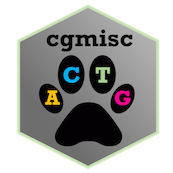

<!-- badges: start -->

# cgmisc 
[](https://github.com/cgmisc-team/cgmisc/actions/workflows/R-CMD-check.yaml)
<!-- [](https://codecov.io/gh/cgmisc-team/cgmisc?branch=master) -->
[](https://github.com/cgmisc-team/cgmisc/actions/workflows/main.yml)
<!-- badges: end -->

## Overview

**cgmisc** is a R package that enables enhanced data analysis and visualisation of results from GWAS. The package contains several utilities and modules that complement and enhance the functionality of existing softwares. It also provides several tools for advanced visualisation of genomic data and utilises the power of the R language to aid in preparation of publication-quality figures. Some of the package functions are specific for the domestic dog (*Canis familiaris*) data.

## Releases
Beginning from version 2.9.11, we are no longer using releases system. Instead, we maintain cgmisc in the CD/CI manner. From time to time, major versions will be frozen and available as source packages. Otherwise, track commit messages to know what has changed.

## Docker container
To ensure reproducibility of articles using `cgmisc`, we provide a Docker container with working `GenABEL` and pre-installed `cgmisc`.
We have recently moved to [ghcr.io](https://github.com/orgs/cgmisc-team/packages?repo_name=cgmisc) and no longer maintain images on 
DockerHub. To pull and run the container:

```
docker pull ghcr.io/cgmisc-team/cgmisc:release
```

## Pre-requisites
`cgmisc` enchances functionalities of `GenABEL` package which is, unfortunately, no longer supported. Thus you will need to install it manualy from source available on CRAN Package Archives and, in addition, you need to be advised that GenABEL won't compile for r-base > 4.1.3! Thus we strongly recommend to go for the Docker container solution:

*  `install.packages("https://cran.r-project.org/src/contrib/Archive/GenABEL.data/GenABEL.data_1.0.0.tar.gz", type='source', repos=NULL)`  

*  `install.packages("https://cran.r-project.org/src/contrib/Archive/GenABEL/GenABEL_1.8-0.tar.gz", type='source', repos=NULL)`  

In addition, some more packages are required, but they should be installed automatically.
We recommend to use an excellent `renv` package to recreate optimal environment for `cgmisc` installation. First, retrieve the `renv.lock` file:  
```wget https://raw.githubusercontent.com/cgmisc-team/cgmisc/master/renv.lock```  
and put it in your project directory. Next, type this in R:
```
install.packages(renv)
library(renv)
renv::init()
```

## Installation 
Otherwise, we recommend installing *cgmisc* by using:
`devtools::install_github('cgmisc-team/cgmisc')`

To install using the tarball, open a terminal and type: 
`R CMD INSTALL cgmisc_[version].tar.gz`

## How to cite `cgmisc`
Kierczak M, Jablonska J, Forsberg SKG, Bianchi M, Tengvall K, Pettersson M, Scholz V, Meadows JRS, Jern P, Carlborg O Lindblad-Toh K. cgmisc: enhanced genome-wide association analyses and visualization. Bioinformatics. Oxford University Press; 2015;31: 3830-3831. 
doi:10.1093/bioinformatics/btv426

## Selected publications that used `cgmisc`

Here we list some publications where cgmisc has been helpful:
* [Sigurðardóttir H. et al. The genetics of gaits in Icelandic horses goes beyond DMRT3, with RELN and STAU2 identified as two new candidate genes. Genetics Selection 2023](https://link.springer.com/article/10.1186/s12711-023-00863-6)

* [Bannasch DL. et al. Pigment Intensity in Dogs is Associated with a Copy Number Variant Upstream of KITLG. Genes 2020.](https://www.mdpi.com/2073-4425/11/1/75)
  
* [Vernau KM. et al. A Missense Variant in ALDH5A1 Associated with Canine Succinic Semialdehyde Dehydrogenase Deficiency (SSADHD) in the Saluki Dog. Genes 2020.](https://www.mdpi.com/2073-4425/11/9/1033)
  
* [Bianchi M. et al. Whole-genome genotyping and resequencing reveal the association of a deletion in the complex interferon alpha gene cluster with hypothyroidism in dogs. BMC Genomics 2020.](https://bmcgenomics.biomedcentral.com/articles/10.1186/s12864-020-6700-3)

* [Weich K. et al. Pigment Intensity in Dogs is Associated with a Copy Number Variant Upstream of KITLG. Genes 2020.](https://doi.org/10.3390/genes11010075)

* [Mikkola LI et al. Novel protective and risk loci in hip dysplasia in German Shepherds. PLoS Genetics 2019.](https://doi.org/10.1371/journal.pgen.1008197)

* [Raymond B et al. Genome-wide association study for bone strength in laying hens. J Anim Sci 2018. 96 (7) 2525-2535.](https://doi.org/10.1093/jas/sky157)

* [Brown EA et al. FGF4 retrogene on CFA12 is responsible for chondrodystrophy and intervertebral disc disease in dogs. PNAS 2017. 114 (43) 11476-11481.](https://doi.org/10.1073/pnas.1709082114)

